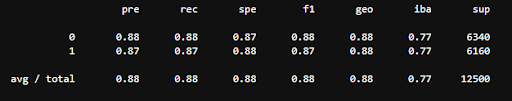
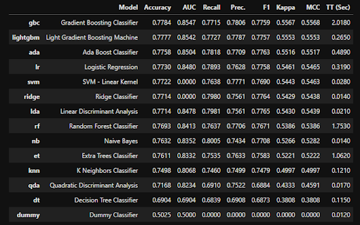

# Movie Survey sentiment analysis

Project 2 - Brian, Tyler, Troy, GP

DataSet: https://www.kaggle.com/lakshmi25npathi/imdb-dataset-of-50k-movie-reviews
DataSet information: http://ai.stanford.edu/~amaas/papers/wvSent_acl2011.pdf

New Library Used: https://www.kaggle.com/nareshbhat/starter-guide-to-build-nlp-ml-model-in-pycaret

## *Power Point Presentation can be found under 'Presentation' folder*

---

## Introduction:

We are doing a Movie Sentiment Analysis where we are taking a dataset containing movie reviews that are labeled as a positive or negative review. This dataset been prepared and tested by Stanford University, where they created a model where it gave 100% accuracy when finding if a movie review is positive or negative. We are using multiple deep learning techniques on our end to try to find which model can most accurately predict and compare the accuracy to the actual sentiment that Stanford has produced. We are using the LSTM and the AdaBoost classifier for an analysis on word count in the reviews. We are using PyCaret for topic modeling,which is an analysis on topics in the movie reviews. Later we will ask the class in the main Slack chat to pick a movie for us to run our model on to see if our model could predict if it would be a positive or negative review.

Project Scope:
Stanford University have generated a IMDB Survey dataset with 50K rows and did a sentiment analysis with 50:50
split for positive and negative reviews.

Goal is to generate models and compare the accuracy against the sentiment analysis provided in the dataset.
1) Build Word Tokenizer ( Check if PCA can be applied)- Team
2) Build LTSM Model - Tyler
3) Build  Adaboost Classifier model - Troy
4) Generate models using PyCaret - GP
5) Generate Metrics
6) Visualizations - Brain
7) Compare SciKit and PyCaret models for Accuracy - Team
8) Presentation - Brain

---

## Conclusion:

For our word count analysis, the LSTM Model was the most accurate in predicting positive and negative reviews.

For our topic modeling analysis, the most accurate deep learning model was Gradient Boost Classifier 

